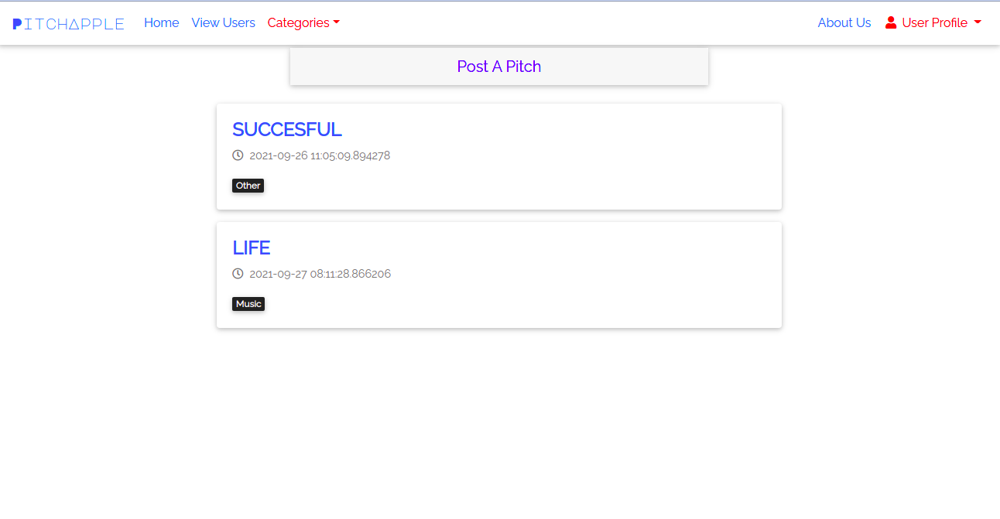
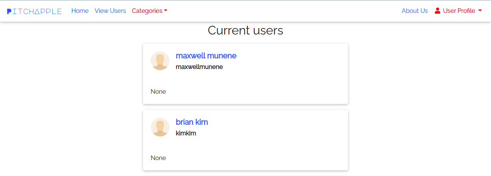
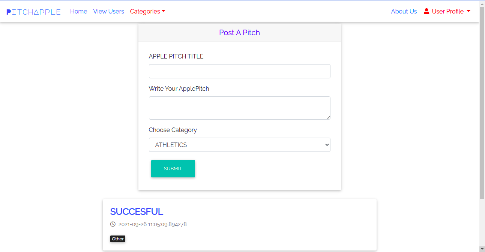
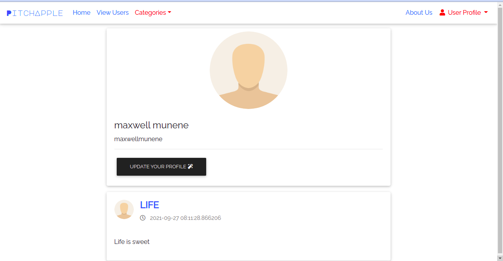

####  PITCHAPPLE
* An application that allows users to submit a one minute pitch and other viewers will vote on them and leave comments to give their feedback on them.

## Author - [ MAXWELL Munene]
------------------------------------------------------------------------------------------------------
## User Story
* Users can :

* see the pitches other people have posted.
* vote on the pitch they liked and give it a downvote or upvote.
* be signed in for me to leave a comment
* receive a welcoming email once I sign up.
* view the pitches I have created in my profile page.
* comment on the different pitches and leave feedback.
* submit a pitch in any category.
* view the different categories.

## Live link 

## Project Objectives
* Project must have a user model.
* In models, implement at least 1 one-to-many relationship.
* Project should have a comment model.
* Project should have a profile page.
* Project should follow the proper folder structure.
* Project should have a functioning authentication system.
* Project should contain migration files for the different model structure.             |

## Technologies Used
* Python
* Flask 
* PostgreSQL
* SQLAlchemy
* HTML 
* CSS
* Javascript
* Flask-Bootstrap

## Requirements
* This program requires python3.+ (and pip) installed, a guide on how to install python on various platforms can be found [here](https://www.python.org/)
* Once python is installed, install the folowing external libraries provided in the requirements.txt file using pip
* Example: 
    * **`pip install flask`**

## Installation and Set-up
To view the app, open the live site link provided below on the README.
Here is a run through of how to set up the application:
* **Step 1** : Clone this repository using **`git clone https://github.com/tailorv/pitchapple.git`**, or downloading a ZIP file of the code.
* **Step 2** : The repository, if downloaded as a .zip file will need to be extracted to preferred location and opened
* **Step 3** : Go to the project root directory and install the virtualenv library using pip an afterwards create a virtual environment. Run the following commands respectively:
    * **`pip install virtualenv`**
    * **`virtualenv pitchapple`**
    * **`source venv/bin/activate`**
        * Note that you can exit the virtual environment by running the command **`deactivate`**
* **Step 4** : Go to config.py and set the SQLALCHEMY_DATABASE_URI to own, you may use Postgres or any other SQL databse client.
* **Step 5** : Download the all dependencies in the requirements.txt using **`pip install -r requirements.txt`**
    * Create a file in root directory called start.sh and store a generated SECRET key like so **`export SECRET_KEY="<your-key>"`**
    * On the same file write down the command **`python3 manage.py server`** 
* **Step 6** : On terminal, run the following command, **`chmod a+x start.sh`**
    * You can now launch the application locally by running the command **`./start.sh`** 

## Support and contact details
You can provide feedback or raise any issues/ bugs through the following means:
* maxwellmuthomijr@gmail.com

## License
{MIT License

Copyright (c) 2021

Permission is hereby granted, free of charge, to any person obtaining a copy of this software and associated documentation files (the "Software"), to deal in the Software without restriction, including without limitation the rights to use, copy, modify, merge, publish, distribute, sublicense, and/or sell copies of the Software, and to permit persons to whom the Software is furnished to do so, subject to the following conditions:

The above copyright notice and this permission notice shall be included in all copies or substantial portions of the Software.

THE SOFTWARE IS PROVIDED "AS IS", WITHOUT WARRANTY OF ANY KIND, EXPRESS OR IMPLIED, INCLUDING BUT NOT LIMITED TO THE WARRANTIES OF MERCHANTABILITY, FITNESS FOR A PARTICULAR PURPOSE AND NONINFRINGEMENT. IN NO EVENT SHALL THE AUTHORS OR COPYRIGHT HOLDERS BE LIABLE FOR ANY CLAIM, DAMAGES OR OTHER LIABILITY, WHETHER IN AN ACTION OF CONTRACT, TORT OR OTHERWISE, ARISING FROM, OUT OF OR IN CONNECTION WITH THE SOFTWARE OR THE USE OR OTHER DEALINGS IN THE SOFTWARE. } Copyright (c) {2021} { Munene}
